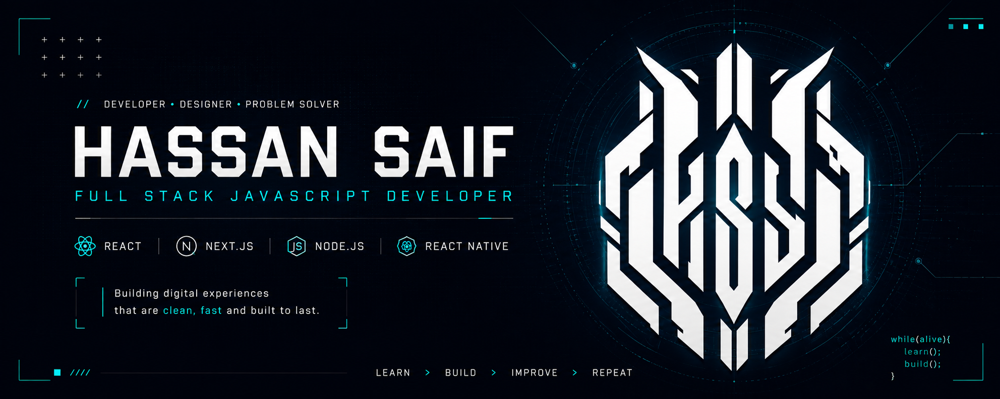

<p align="center">
  
</p>

<p align="center">
  <a href="https://mrhassansaif.github.io/my-portfolio2.0/"></a>
  &nbsp;&nbsp;&nbsp;&nbsp;
  <a href="https://www.linkedin.com/in/mr-hassansaif/"></a>
  &nbsp;&nbsp;&nbsp;&nbsp;
  <a href="mailto:hassansaif0ki@gmail.com"></a>
  &nbsp;&nbsp;&nbsp;&nbsp;
  <a href="https://www.instagram.com/mrhassan_saif/"></a>
  &nbsp;&nbsp;&nbsp;&nbsp;
  <a href="https://www.facebook.com/mr.hassansaif/"></a>
  &nbsp;&nbsp;&nbsp;&nbsp;
  <a href="https://x.com/Mr_Hassan_Saif"></a>
</p>

---

# Hey, I'm Hassan 👋

### Full Stack JavaScript Developer

📍 Karachi, Pakistan
🎓 BS Computer Science
💼 Open to Frontend, Full Stack & JavaScript opportunities

> *Still trying to understand the universe while debugging JavaScript.*

---

## 👨‍💻 About Me

I'm a **Full Stack JavaScript Developer from Karachi** who got into programming through gaming and never really left.

My journey started with simple curiousity

> **"How do they worked, how things could be changed, and what was happening behind the scenes."**

What started as messing around with games eventually turned into a genuine interest in programming and one very big rabbit hole. That rabbit hole took me from HTML and CSS into **JavaScript, React, Node.js, Next.js, databases, APIs, cloud services, and full-stack application development**.

These days, I split my time between **client work, personal projects, and finishing my Computer Science degree online**. I've worked on production websites, business applications, dashboards, integrations, and custom web experiences using technologies ranging from **React and Next.js to WordPress, Wix, and Shopify**.

I enjoy working where **logic meets creativity**. I like solving the technical problem, but I also care about the interface, the details, and how the final product actually feels to the person using it. At the end of the day, I like building things that **actually work in the real world**, not just things that look good in a repository.

Outside of code, I'm usually somewhere between **gaming, space, sci-fi, design, photography, and random technical rabbit holes**.

---

# ⚡ What I'm Focused On

<table>
<tr>
<td width="50%">

### ⚛️ Modern Frontend

Building with **React & Next.js** while improving component architecture, responsive UI, state management, and performance.
&nbsp;&nbsp;&nbsp;&nbsp;&nbsp;&nbsp;&nbsp;&nbsp;&nbsp;&nbsp;

</td>

<td width="50%">

### 🧠 Full Stack

Working with **Node.js, Express, APIs, Supabase, Firebase, authentication, databases, and cloud services**.
&nbsp;&nbsp;&nbsp;&nbsp;&nbsp;&nbsp;&nbsp;&nbsp;&nbsp;&nbsp;&nbsp;&nbsp;&nbsp;&nbsp;&nbsp;&nbsp;&nbsp;&nbsp;&nbsp;&nbsp;&nbsp;&nbsp;&nbsp;&nbsp;&nbsp;&nbsp;&nbsp;&nbsp;&nbsp;&nbsp;&nbsp;&nbsp;&nbsp;&nbsp;&nbsp;&nbsp;&nbsp;&nbsp;&nbsp;

</td>
</tr>

<tr>
<td width="50%">

### 📱 Mobile

Exploring **React Native** and learning how to carry good web development principles into mobile applications.
&nbsp;&nbsp;&nbsp;&nbsp;&nbsp;&nbsp;&nbsp;&nbsp;&nbsp;&nbsp;&nbsp;&nbsp;&nbsp;&nbsp;&nbsp;&nbsp;&nbsp;&nbsp;&nbsp;&nbsp;&nbsp;&nbsp;&nbsp;&nbsp;&nbsp;&nbsp;&nbsp;&nbsp;&nbsp;&nbsp;&nbsp;&nbsp;&nbsp;&nbsp;&nbsp;&nbsp;&nbsp;&nbsp;&nbsp;
</td>

<td width="50%">

### 🤖 What's Next

Learning more about **AI, cloud technologies, automation, system design, and modern development workflows**.
&nbsp;&nbsp;&nbsp;&nbsp;&nbsp;&nbsp;&nbsp;&nbsp;&nbsp;&nbsp;&nbsp;&nbsp;&nbsp;&nbsp;&nbsp;&nbsp;&nbsp;&nbsp;&nbsp;&nbsp;&nbsp;&nbsp;&nbsp;&nbsp;&nbsp;&nbsp;&nbsp;&nbsp;&nbsp;&nbsp;&nbsp;&nbsp;&nbsp;&nbsp;&nbsp;&nbsp;&nbsp;&nbsp;&nbsp;
</td>
</tr>
</table>

---


# 🛠️ Tech Stack

### Frontend

<p>
  
</p>

### Backend & Data

<p>
  
</p>

### Tools & Platforms

<p>
  
</p>

### Game Development & 3D - Exploring

<p>
  &nbsp;&nbsp;
  &nbsp;&nbsp;
  &nbsp;&nbsp;
</p>

### Also Work With

<p>
  &nbsp;&nbsp;
  &nbsp;&nbsp;
  &nbsp;&nbsp;
  &nbsp;&nbsp;
  &nbsp;&nbsp;
  
</p>

#### 🔌 APIs, Web & Performance

`REST APIs` · `SSL/TLS` · `Rate Limiting` · `DNS & Domains` · `Responsive UI` · `SEO` · `HubSpot CRM` · `Custom Integrations` · `Performance Optimization` · `API Integration` · `Authentication` · `Cloud Deployment`

#### 🧩 CMS & WordPress Ecosystem

`WordPress` · `WooCommerce` · `Elementor` · `WPBakery` · `Custom Themes` · `Custom Plugins` · `Website Migration` · `SEO Optimization` · `Performance Optimization`

---

# 🌌 Beyond Code

A little more <b>Hassan</b> and a little less résumé.

<table>
  <tr>
    <td style="white-space: nowrap;"><strong>🌌 Astronomy</strong></td>
    <td>Space has always fascinated me. Stars, planets, galaxies, black holes, the possibility of extraterrestrial life... I can disappear into a space rabbit hole for hours.</td>
  </tr>
  <tr>
    <td style="white-space: nowrap;"><strong>🤖 AI & Tech</strong></td>
    <td>Genuinely curious about where AI is taking software development. I love experimenting with AI tools, new workflows, and finding smarter ways to build things.</td>
  </tr>
  <tr>
    <td style="white-space: nowrap;"><strong>🛰️ Sci-Fi & Cyberpunk</strong></td>
    <td>Cyberpunk cities, futuristic interfaces, neon lights, dystopian worlds, spaceships and anything that looks like it came from 2077. You can probably tell from my UI preferences. XD</td>
  </tr>
  <tr>
    <td style="white-space: nowrap;"><strong>🎌 Anime</strong></td>
    <td>Huge anime nerd. I love good world-building, character development, insane fights, psychological stories and anything that makes me say "one more episode" at 3 AM.</td>
  </tr>
  <tr>
    <td style="white-space: nowrap;"><strong>🎬 Movies & TV</strong></td>
    <td>Superhero movies, sci-fi, thrillers, fantasy and anything with a good story. I'm especially into universes where you can spend hours going down lore rabbit holes.</td>
  </tr>
  <tr>
    <td style="white-space: nowrap;"><strong>🦸 Marvel & DC</strong></td>
    <td>Marvel and DC have been part of my entertainment diet for years. Heroes, villains, alternate universes, timelines and ridiculous amounts of lore? Yeah, I'm in.</td>
  </tr>
  <tr>
    <td style="white-space: nowrap;"><strong>🎮 Games</strong></td>
    <td>Story-driven games &gt; competitive games. Give me a strong world, atmosphere, characters and soundtrack and I'm probably disappearing for the next few hours. I go by <strong>DemonWolf</strong>.</td>
  </tr>
  <tr>
    <td style="white-space: nowrap;"><strong>🎨 Design</strong></td>
    <td>Graphic design is one of the reasons I care so much about UI. I don't just want something to work, I want it to actually look and feel good too.</td>
  </tr>
  <tr>
    <td style="white-space: nowrap;"><strong>📷 Photography</strong></td>
    <td>I enjoy photography and playing around with composition, lighting and perspective. Sometimes you just need to step away from the code and look at things differently.</td>
  </tr>
  <tr>
    <td style="white-space: nowrap;"><strong>🏍️ Mechanical Stuff</strong></td>
    <td>Not everything needs a keyboard and a debugger. I like tinkering with bikes, electrical work, wiring and figuring out how mechanical things work.</td>
  </tr>
  <tr>
    <td style="white-space: nowrap;"><strong>☕ UI Overthinking</strong></td>
    <td>I can spend three hours fixing a 4px alignment issue that absolutely nobody else noticed. And yes, I will do it again.</td>
  </tr>
  <tr>
    <td style="white-space: nowrap;"><strong>🧠 Curiosity</strong></td>
    <td>I have a habit of going way too deep into random topics. If something catches my interest, suddenly I'm 17 tabs deep researching how it works.</td>
  </tr>
  <tr>
    <td style="white-space: nowrap;"><strong>🌐 Web & Building</strong></td>
    <td>I genuinely enjoy taking an idea and turning it into an actual website or product. That's probably why I've ended up working across frontend, full-stack, WordPress, Wix and a bunch of other things.</td>
  </tr>
</table>

---

# 🧪 Current Side Quests

```text
[ ACTIVE ]

🧩  Find a way to make every project slightly cooler than it needs to be
🛠️  Turn random "what if I built this?" ideas into actual projects
🤖  See how far AI can take my development workflow without becoming dependent on it
🌐  Build things that are actually useful, not just impressive demos
🧠  Figure out why something works instead of just making it work
🎨  Experiment with weird UI ideas that probably have no business being this polished
⚙️  Break things, fix them, and learn why they broke
🗃️  Finally organize the 47 unfinished ideas living rent-free in my head
💻  Become dangerous enough with the stack that tutorials become optional
🎌  Maintain a healthy work-to-anime ratio (current status: questionable)
🌌  Investigate another completely unnecessary astronomy question at 2 AM
☕  Refuse to accept that "good enough" is actually good enough
```


---

# 📂 What You'll Find Around Here

Not everything in here is a polished production application.

Some repositories are experiments.

Some are learning projects.

Some are university work.

Some started because I wanted to know **"what happens if I try this?"**

And that's kind of the point.

I like learning by **building, breaking, fixing, and rebuilding**.

---

# 📚 Favorite Quote

> **"Any sufficiently advanced technology is indistinguishable from magic."**
> **"~ Arthur C. Clarke"**

---

## 💭 Let's Talk

Whether you want to collaborate on a project, discuss technology, geek out about astronomy, or just say hello, my inbox is always open.

<p align="center">
  <a href="https://mrhassansaif.github.io/my-portfolio2.0/"></a>
  &nbsp;&nbsp;&nbsp;&nbsp;
  <a href="https://www.linkedin.com/in/mr-hassansaif/"></a>
  &nbsp;&nbsp;&nbsp;&nbsp;
  <a href="mailto:hassansaif0ki@gmail.com"></a>
  &nbsp;&nbsp;&nbsp;&nbsp;
  <a href="https://www.instagram.com/mrhassan_saif/"></a>
  &nbsp;&nbsp;&nbsp;&nbsp;
  <a href="https://www.facebook.com/mr.hassansaif/"></a>
  &nbsp;&nbsp;&nbsp;&nbsp;
  <a href="https://x.com/Mr_Hassan_Saif"></a>
</p>

<p align="center">
  <code>STATUS: ONLINE</code>
  &nbsp;
  <code>LOCATION: KARACHI</code>
  &nbsp;
  <code>MODE: BUILDING</code>
</p>

---

<p align="center">
  <strong>Always learning · Always building · Usually overthinking UI</strong>
</p>

<p align="center">
  <sub>
    Thanks for stopping by. Explore the repositories, break something, learn something, and build something better.
  </sub>
</p>

<br />

<p align="center">
  
</p>
